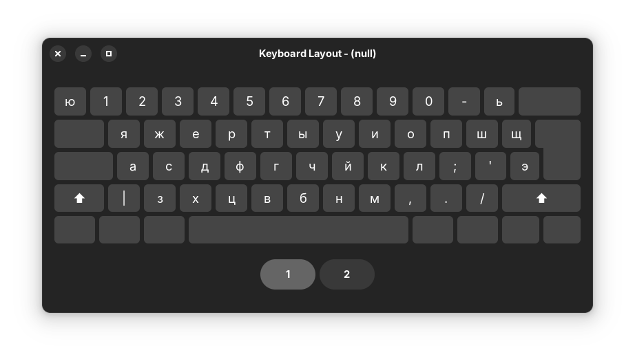

# xkb-ru-yazherty
Windows port of the [XKB](https://www.x.org/wiki/XKB/) Russian phonetic **YAZHERTY layout**.

This repository also includes a **YAZHERTZ variant** for users who prefer a QWERTZ-style keyboard layout.

## Layout Preview

  
  

## Contents

- `keyboard_layout_YAZHERTY.klc` - Windows keyboard layout file for YAZHERTY
- `keyboard_layout_YAZHERTZ.klc` - Windows keyboard layout file for YAZHERTZ
- `russian_phonetic_YAZHERTY.pdf` - Visual layout graphic for YAZHERTY
- `russian_phonetic_YAZHERTZ.pdf` - Visual layout graphic for YAZHERTZ

Precompiled versions of both layouts are available on the [releases](https://github.com/marekvonrogall/xkb-ru-yazherty/releases) page, ready to install on Windows.

*Created & compiled using [Microsoft Keyboard Layout Creator (MSKLC) 1.4](https://www.microsoft.com/en-us/download/details.aspx?id=102134).
Visual layout graphics generated using [xkbprint](https://www.x.org/archive/X11R7.5/doc/man/man1/xkbprint.1.html).*

## Installation

1. Download the desired layout file from the [releases](https://github.com/marekvonrogall/xkb-ru-yazherty/releases) page.
2. Extract and run the included installer (`setup.exe`).
3. The layout will be available in your Windows language settings.
4. Restart your PC if the layout does not work properly.
